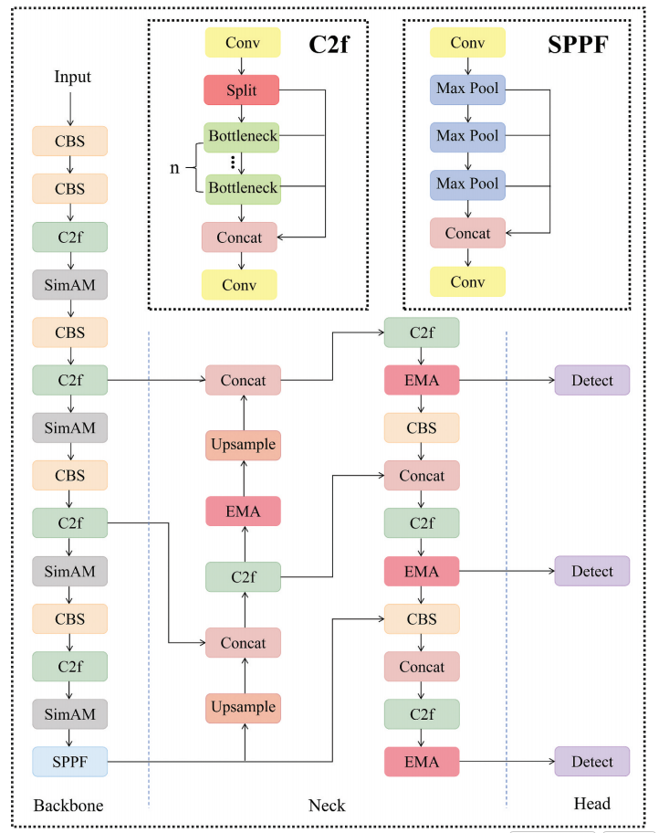
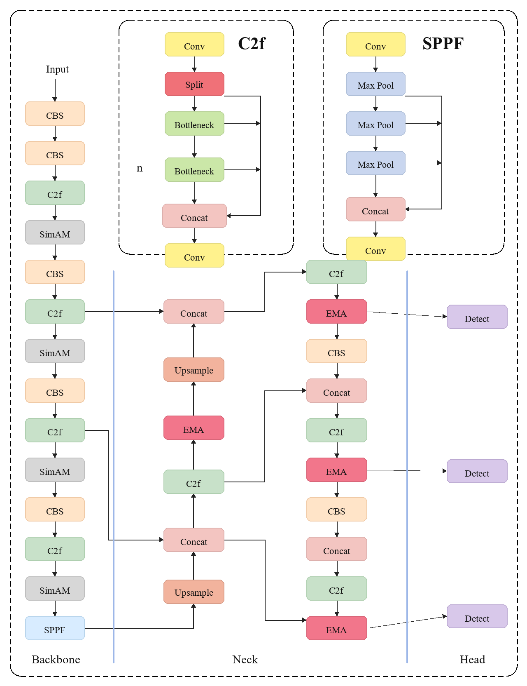

# Visio 图表重绘器 (Visio Figure Redrawer)

Visio Figure Redrawer 是一个项目感知（Project-Aware）的 Visio 图形重建工具包。它旨在将参考图、论文项目、模型配置文件（如 YOLO/RT-DETR）转换为可编辑的 Microsoft Visio `.vsdx` 图表。

与传统的图像转矢量工具不同，它专注于**论文架构图的语义化重建**。它能理解论文项目的上下文（如 LaTeX 标题、模型代码、YAML 配置），并应用符合主流期刊（Nature, IEEE, Elsevier 等）要求的视觉风格。

## 能做什么

- **项目感知草拟**：自动扫描论文/模型项目文件夹，提取 LaTeX 标题、模型层级、Python 模型定义等上下文。
- **参考优先重绘**：模仿任意参考图的布局、配色、箭头风格和分组逻辑。
- **YAML 转架构图**：直接从 YOLO/RT-DETR 等模型的 YAML 配置文件生成初步的架构图。
- **期刊风格应用**：一键切换 Nature, IEEE (灰度/彩色), Elsevier, IOP/SPIE 等期刊的风格配置文件。
- **输出可编辑 Visio**：生成真正的 Visio 形状和连接线，而非简单的图片嵌入。
- **QA 审计与预览**：在生成 `.vsdx` 前，先审计 JSON 规范并渲染 PNG 预览。

## 典型场景

- **复刻论文插图**：将一张已有的参考图重建为可编辑的 Visio 文件，方便后续修改。
- **从模型代码绘图**：让 AI 读取 Python 模型代码或 YAML 配置，自动生成架构草图。
- **期刊投稿适配**：将现有的彩色图表一键转换为 IEEE 要求的灰度模式或 Nature 要求的极简风格。
- **项目文档化**：扫描整个论文项目，自动整理出包含所有图片标题和上下文的审查清单。

## 效果示例

以下示例展示了从原始参考图到 Visio 重建预览图的效果。

| 原始参考图 (Reference) | Visio 重建预览 (Redrawn) |
| :--- | :--- |
|  |  |
| *YOLO 风格架构参考图* | *使用本工具重建的 Visio 预览* |

## 环境要求

- **Windows 系统**（渲染 `.vsdx` 必须）。
- **Microsoft Visio 桌面版**（已安装）。
- **Python 3.10+**。
- `requirements.txt` 中的 Python 依赖。

检查本地环境是否就绪：
```powershell
powershell.exe -NoProfile -ExecutionPolicy Bypass -File .\scripts\check_environment.ps1
```

## 安装方式

### 作为 Codex Skill 安装

将本仓库克隆或复制到 Codex 的 skills 目录：
```powershell
git clone https://github.com/<owner>/visio-figure-redrawer.git "$env:USERPROFILE\.codex\skills\visio-figure-redrawer"
cd "$env:USERPROFILE\.codex\skills\visio-figure-redrawer"
python -m pip install -r requirements.txt
```
在 Codex 中使用 `$visio-figure-redrawer` 即可触发。

### 作为普通 CLI 工具安装
```powershell
git clone https://github.com/<owner>/visio-figure-redrawer.git
cd visio-figure-redrawer
python -m pip install -r requirements.txt
```

## 快速开始

### 1. 从项目扫描上下文
```powershell
python .\scripts\scan_paper_project.py --project C:\path\to\your\paper --out .\work\context.json
```

### 2. 从 YAML 配置文件生成初稿
```powershell
python .\scripts\yaml_to_figure_spec.py --yaml C:\path\to\model.yaml --out .\work\model.json --title "Model Architecture"
```

### 3. 应用期刊风格
```powershell
python .\scripts\apply_journal_profile.py --spec .\work\model.json --profile ieee-grayscale --out .\work\model.ieee.json
```

### 4. 预览与渲染
```powershell
# 渲染预览图
python .\scripts\render_preview_from_spec.py --spec .\work\model.ieee.json --out .\work\preview.png

# 生成 Visio 文件
powershell.exe -NoProfile -ExecutionPolicy Bypass -File .\scripts\draw_visio_from_spec.ps1 -SpecPath .\work\model.ieee.json -OutVsdx .\work\figure.vsdx
```

## 内置风格配置文件

这些配置定义在 `assets/journal-style-profiles.json` 中：
- `reference-first`: 模仿参考图。
- `nature-minimal`: 极简风格，适合 Nature 系列。
- `ieee-grayscale`: 标准 IEEE 灰度投稿要求。
- `elsevier-clean`: Elsevier 风格。
- `iop-spie-technical`: 适合物理/光学类期刊。

## 仓库结构

```
visio-figure-redrawer/
├── SKILL.md                 # Skill 触发逻辑
├── agents/                  # AI Agent 配置
├── assets/                  # 样式配置及示例资产
├── docs/                    # 发行说明
├── references/              # 规格协议与工作流文档
├── scripts/                 # 核心 Python/PowerShell 脚本
│   ├── scan_paper_project.py    # 扫描项目上下文
│   ├── yaml_to_figure_spec.py   # YAML 转 JSON 规格
│   ├── apply_journal_profile.py # 应用期刊风格
│   ├── audit_figure_spec.py     # 审计规格风险
│   ├── render_preview_from_spec.py # 渲染 PNG 预览
│   └── draw_visio_from_spec.ps1    # 调用 Visio 渲染 VSDX
├── requirements.txt         # 依赖清单
└── README.md                # 项目说明
```

## 当前限制

- **系统依赖**：`.vsdx` 渲染过程强依赖 Windows 环境和桌面版 Microsoft Visio。
- **代码解析**：对于复杂的 Python `forward()` 逻辑，仍需 Codex 进行语义解释，而非纯自动化静态分析。
- **1:1 复刻**：自动生成的初稿可能需要人工或 AI 辅助调整 JSON 规格以达到完美的出版质量。
- **期刊准则**：内置风格仅作为起点，最终投稿请务必参照目标期刊最新的 Author Guidelines。
